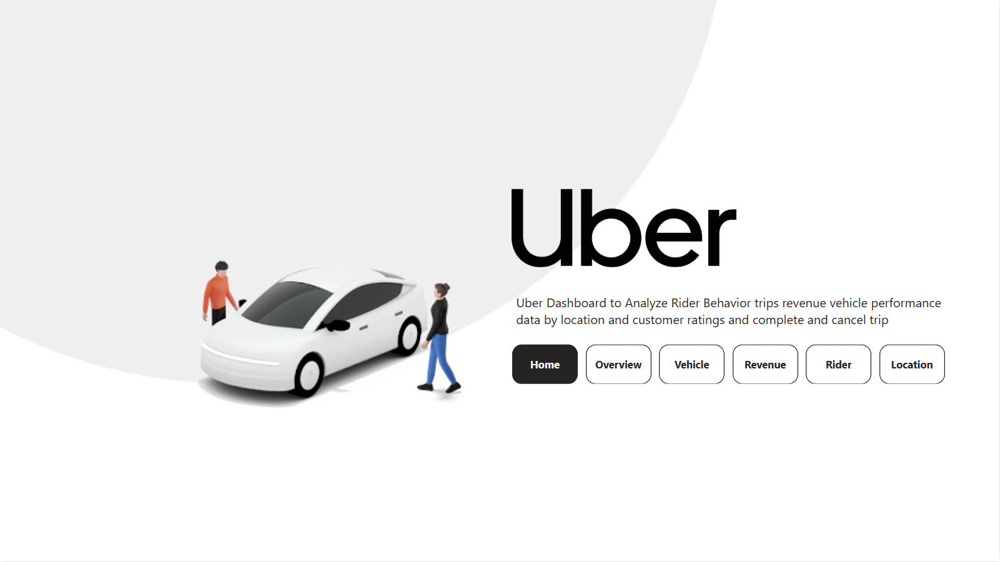
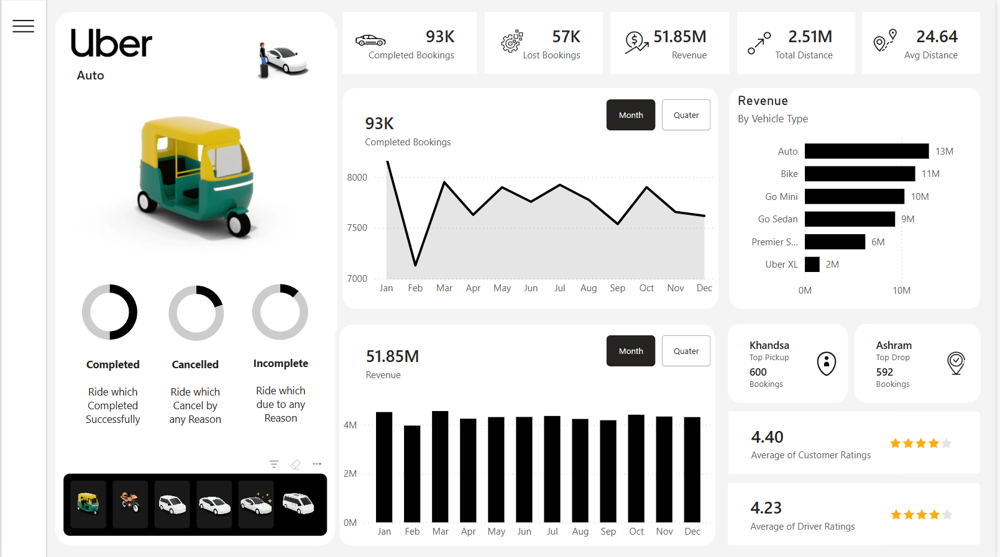
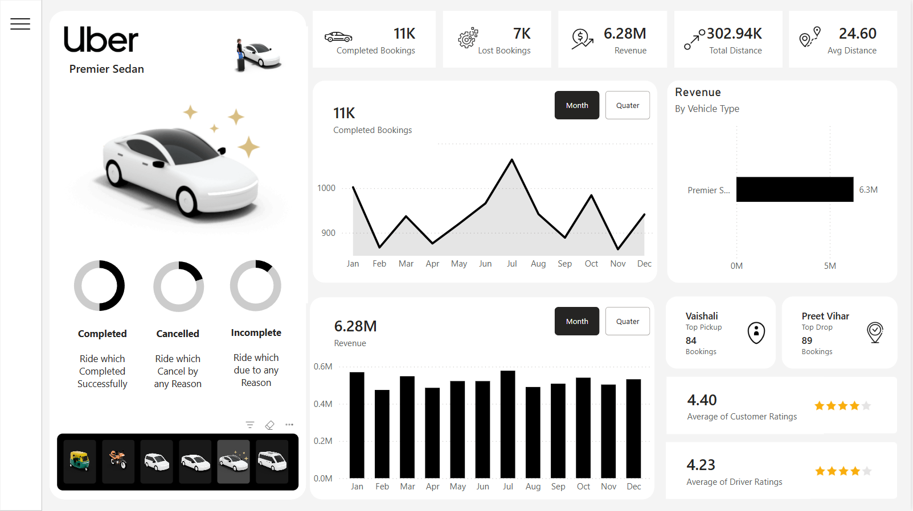
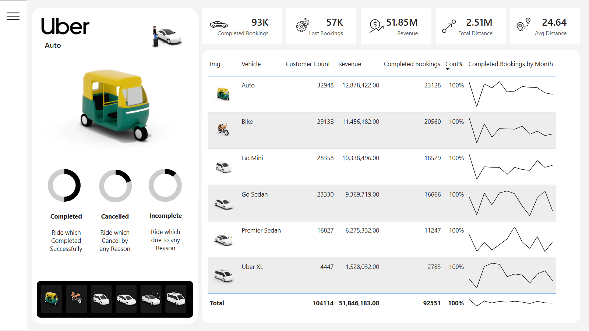
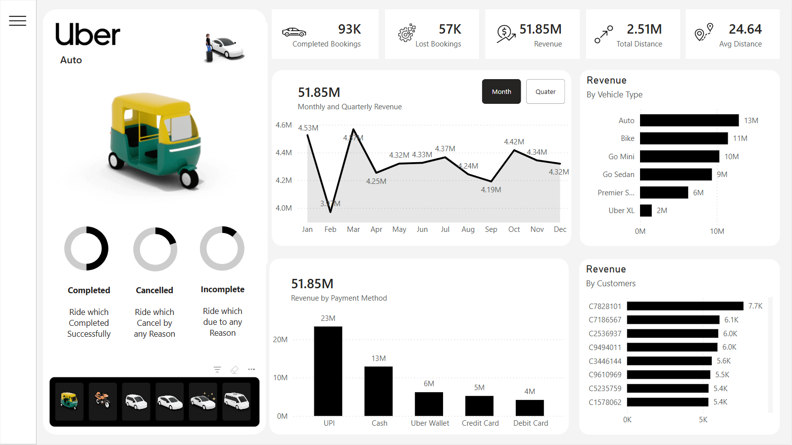
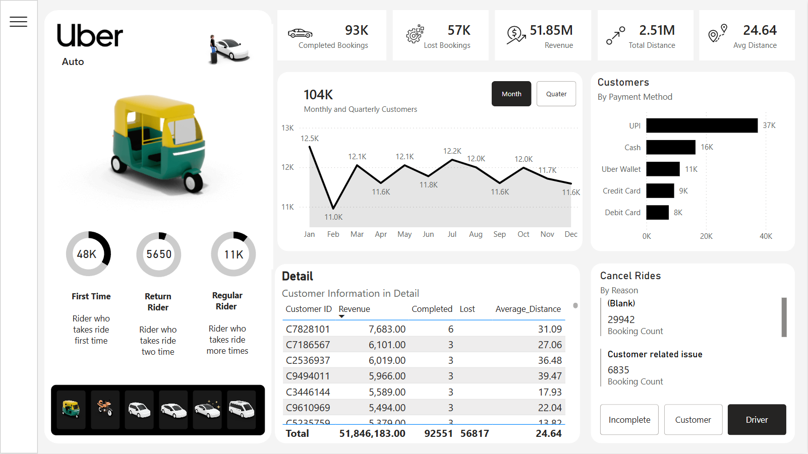
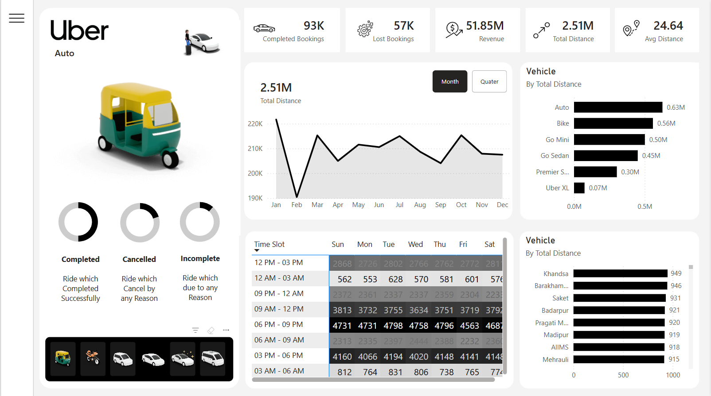

# 🚖 Uber Analytics Dashboard (Power BI)

This project presents a comprehensive analytics dashboard built using Power BI to analyze Uber ride data. The dashboard focuses on operational performance, revenue insights, rider behavior, and location-based patterns, enabling data-driven decision-making.

---

## 📊 Project Overview

The dashboard is designed to provide a complete view of Uber operations through multiple analytical pages:

- Overview Dashboard
- Vehicle Insights
- Revenue Analysis
- Rider Behavior Analysis
- Location Intelligence

The solution includes data modeling, DAX measures, and interactive visualizations to deliver meaningful business insights.

---

## 🎯 Key Features

### 🔹 Overview Page

- KPI Metrics:
  - Completed Bookings
  - Lost Bookings
  - Total Revenue
  - Total Distance
  - Average Distance
- Vehicle Type Filter
- Monthly Analysis:
  - Completed Bookings
  - Revenue
- Quarterly Analysis:
  - Completed Bookings
  - Revenue
- Revenue by Vehicle Type
- Top Pickup & Drop Locations
- Ratings:
  - Average Rider Rating
  - Average Driver Rating

---

### 🚗 Vehicle Page

- Booking Count by Vehicle
- Revenue by Vehicle
- Contribution Analysis

---

### 💰 Revenue Page

- Revenue by Customer
- Revenue by Vehicle
- Revenue by Payment Method
- Monthly & Quarterly Revenue Trends

---

### 🧑 Rider Page

- Cancelled Rides by Reason
- Payment Method Analysis
- Monthly & Quarterly Trends
- Rider Segmentation:
  - First-time Riders
  - Returning Riders
  - Regular Riders
- Detailed Data Table

---

### 📍 Location Page

- Monthly Total Distance
- Distance by Vehicle Type
- Peak Time Slots
- High-Demand Areas

---

## ⚙️ Technical Implementation

- Data Modeling with relationships across multiple tables
- DAX Measures for KPIs and advanced calculations
- Interactive Filters and Slicers
- Dynamic Visualizations
- Drill-down and cross-filtering capabilities
- Custom Filter Panel (Show/Hide functionality)

---

## 📌 Business Insights Delivered

- Identification of high-performing vehicle categories
- Revenue trends across time and payment methods
- Rider behavior patterns and retention insights
- High-demand locations and peak booking times
- Operational inefficiencies such as booking cancellations

---

## 🛠️ Tools & Technologies

- Power BI
- DAX (Data Analysis Expressions)
- Data Modeling Techniques

---

## 📷 Dashboard Preview

---

## 🚀 How to Use

1. Download the `.pbix` file from this repository
2. Open using Power BI Desktop
3. Explore dashboards using filters and slicers

---
